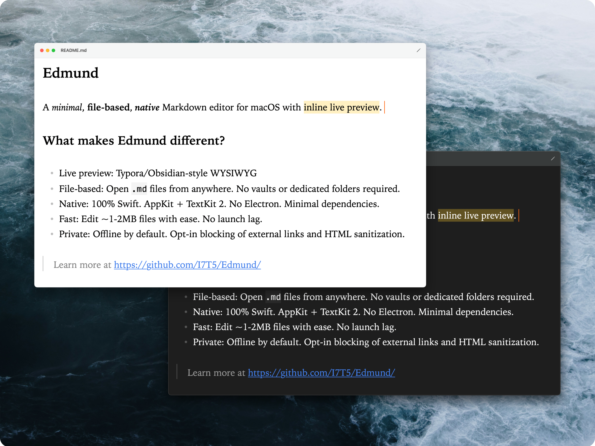
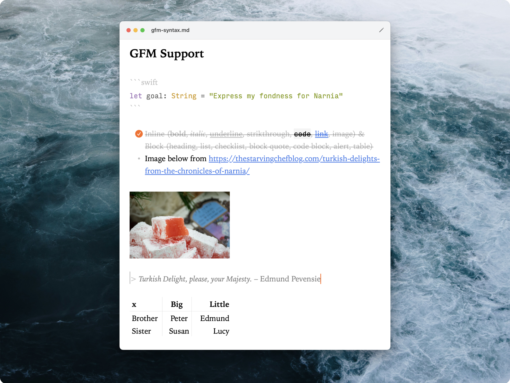
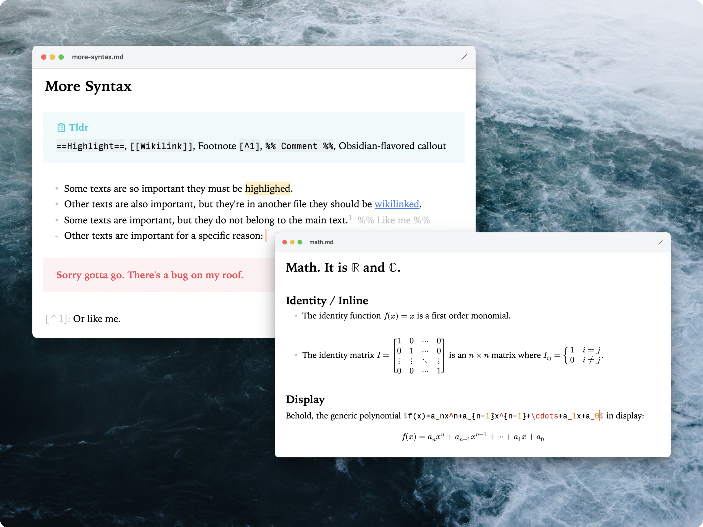
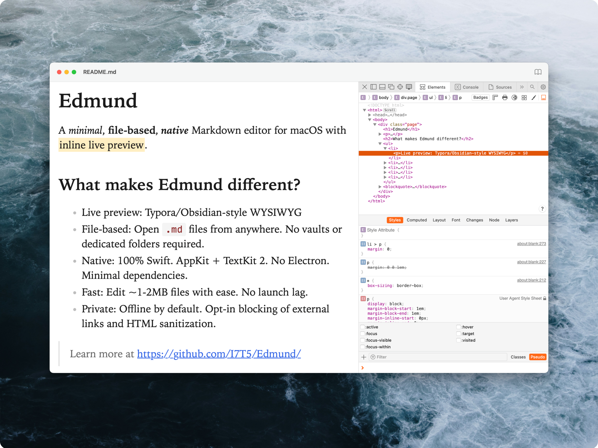
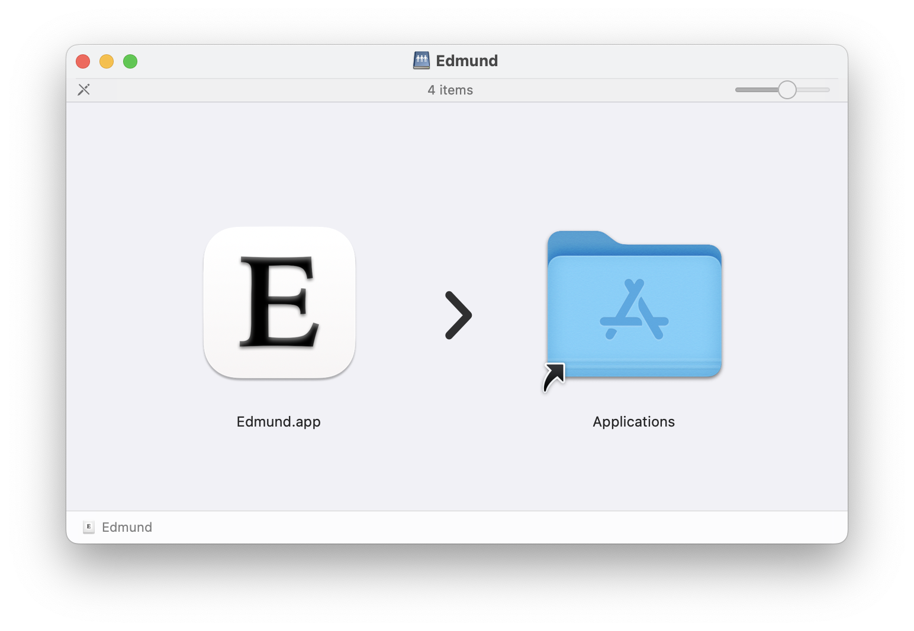

# Edmund

Edmund is a minimal, file-based, native Markdown editor for macOS with inline live preview.  
<!-- Replace "minimal" with "customizable" or "lightweight" once more features are implemented -->

https://github.com/user-attachments/assets/5c9097c7-68d2-4423-b0f5-495979775f6d

Whether as a companion alongside your Markdown knowledge base or as a standalone editor, 
Edmund blends in with macOS and works seamlessly with your files wherever they are. 

Our goal is to be the [CotEditor](https://coteditor.com) of Markdown editors, 
i.e. elegant, powerful, configurable, and native inside out.

> ⚠️ Edmund is currently in beta. See the [roadmap](https://trello.com/b/vw2TveNI) for what's coming next :D

## Differentiators

- Live preview: Typora/Obsidian-style WYSIWYG.
- File-based: Open `.md` files from anywhere. No vaults or dedicated folders required.
- Native: 100% Swift. Based on AppKit and TextKit 2. No Electron. Minimal dependencies.
- Fast: Handles ~1-2MB files with ease. No launch lag.
- Extensible: Opt-in math and Obsidian syntax. Extensions system coming soon!  
- Private: Offline by default. Optional blocking of external links and HTML sanitization.

<!-- Move "Fast" and "Extensible"? Add "integrations" section to Native after implementation -->

See [my blog post](https://i7t5.com/posts/2026-06-26-edmund/) for more of the motivation and design philosophy. 

## Screenshots

## Installation

Get `Edmund.dmg` from the [latest release](https://github.com/I7T5/Edmund/releases/latest), open it, and drag `Edmund.app` to `Applications`: 

> [!WARNING]
> If macOS reports that the app is `🚧DAMAGED🚧` when you're trying to open it for the first time, fear not. 
> The app is not damaged. It's just not signed properly because I am not a $99/yr-certified Apple Developer. 
> Good thing is there's an easy way to bypass the barrier. 
> 
> To open Edmund (or any other "damaged" app) for the first time, choose *one* of the following:
> - System Settings → Privacy & Security → scroll down → Open Anyway. Or, 
> - Run the following line in Terminal: `xattr -dr com.apple.quarantine /Applications/Edmund.app`
>   - You might also need to prepend the command with `sudo`. 

Edmund checks for updates automatically; you can also browse version history [here](https://github.com/I7T5/Edmund/releases).

## Dependencies

- [swift-markdown](https://github.com/swiftlang/swift-markdown)
- [SwiftMath](https://github.com/mgriebling/SwiftMath)
- [Sparkle](https://github.com/sparkle-project/Sparkle)
- [Lucide icons](https://lucide.dev)

## Alternatives

If Edmund's not your thing, some of the following might be: 

- Closed source
  - Obsidian, cyberWriter, Notion
  - Typora, Lettera (beta), LitSquare Ink MD
- Open source
  - WYSIWYG: [MarkText](https://marktext.me), [Nodes](https://nodes-web.com), [Scratch](https://github.com/erictli/scratch)
  - Split-screen: [MacDown](https://macdown.uranusjr.com), [MiaoYan](https://miaoyan.app)
  - [MarkEdit](https://github.com/MarkEdit-app/MarkEdit) - TextEdit for Markdown
    - I *love* this. If only I wasn't so dependent on rendered math...
  - [editxr](https://github.com/pixdeo/editxr) - TUI
  - More feature-rich: [FSNotes](https://fsnot.es), [Zettlr](https://www.zettlr.com), [Joplin](https://joplinapp.org), [Tangent](https://www.tangentnotes.com)

The list is by no means exhaustive, and neither was it meant to be. I just wanted to give credit to the makers of these apps, esp. IMO the aesthetic open sourced ones. A comprehensive list may be found [here](https://github.com/mundimark/awesome-markdown-editors). 

## Acknowledgements

- [CotEditor](https://coteditor.com) for the philosophy
- [Typora](https://typora.io) and [Obsidian](https://obsidian.md) for much of the vision
- [Swift Markdown Engine](https://github.com/nodes-app/swift-markdown-engine) for the architecture reference
- Apple, Iowan Old Style, [Tomorrow Light](https://github.com/chriskempson/tomorrow-theme) and [One Dark](https://github.com/atom/atom/tree/master/packages/one-dark-syntax) for the aesthetics
- [create-dmg](https://github.com/sindresorhus/create-dmg), [screenshot-studio](screenshot-studio.com), and [shields](shields.io) for the utilities
- Claude, [caveman](https://github.com/JuliusBrussee/caveman), and [ponytail](https://github.com/DietrichGebert/ponytail) for the engineering. 
- [RaTeX](https://ratex.lites.dev) and [beautiful-mermaid](https://github.com/lukilabs/beautiful-mermaid) for extension functionalities
<!-- Shiki stays out until a Shiki/TextMate backend actually ships — see CodeSyntaxBackend.swift -->

Most importantly, many thanks to our contributors: 

## License

[Apache License 2.0](LICENSE)
