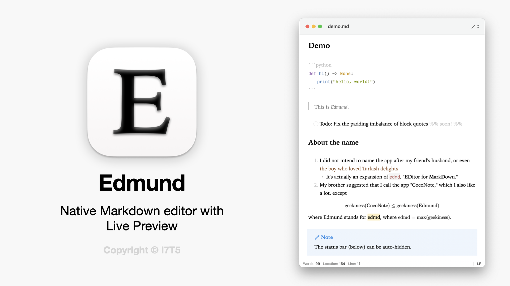

# Edmund

> [!NOTE] 
> - The app is in beta and active development
> - The theme color is actually orange, not brown. More screenshots coming soon. 
> - Guidelines for build and contributing also coming soon!
> - Someday I'll make a better icon...

Edmund is a minimal, file-based, native Markdown editor for macOS with inline live preview.  
<!-- Replace "minimal" with "customizable" once customizations are implemented -->

- **Requirements**: macOS Sonoma 14 or later
- **Website**: [i7t5.com/software/edmund](https://i7t5.com/software/edmund) / [edmund.md](https://edmund.md) (to be developed)

https://github.com/user-attachments/assets/bbd86772-5c08-4440-8a27-7f057b2b9965

## Features

- **Live preview**: WYSIWYG. Render as you type. Hides delimiters outside active word / block by default.
- **Native**: 100% Swift. AppKit base + TextKit 2 editor + WebKit preview + SwiftUI settings. No Electron. 
- **Minimal design**: (Almost) no buttons by default. Keyboard-first. (Shortcuts in progress)
- **Lightweight and fast**: App size ~15 MB. Minimal dependencies. Handles ~1-2MB files with ease. 
- **Markdown-flavor agnostic**: 
  - Follows [cmark-gfm](https://github.com/github/cmark-gfm) through Apple's own [swift-markdown](https://github.com/swiftlang/swift-markdown). 
  - Opt-in support for non-GFM syntax such as ==highlights==, [[WikiLinks]], footnotes `[^1]`, code blocks with syntax highlighting, Obsidian-flavored comments and callouts, etc. (in progress)
  - Renders both inline and display math  using [SwiftMath](https://github.com/mgriebling/SwiftMath). Opt-in extension for better math support through [RaTeX](https://github.com/erweixin/RaTeX) (in progress). 
- **Secure and private**: Offline by default. Block external links setting. Built-in HTML white-listing & sanitization. 
- **Free and open-source**: Apache License 2.0. 

## Installation

I do not have a paid Apple Developer ID, and that makes installing the app a bit more complicated...You probably know the drill, but, in case you don't, here it is. 

To open Edmund the first time, do *one* of:

- System Settings → Privacy & Security → scroll down → Open Anyway. Or, 
- Run the following line in Terminal: `xattr -dr com.apple.quarantine /Applications/Edmund.app`

## Screenshots

## Roadmap

See [ROADMAP](docs/ROADMAP.md). 

## Dependencies

- [swift-markdown](https://github.com/swiftlang/swift-markdown)
- [SwiftMath](https://github.com/mgriebling/SwiftMath)
- [Sparkle](https://github.com/sparkle-project/Sparkle)

## Alternatives

If Edmund's not your thing, some of the following might be: 

- Closed source
  - Obsidian, cyberWriter, Notion
  - Typora, Lettera ([beta](https://lettera.md))
- Open source
  - WYSIWYG: [MarkText](https://marktext.me), [Nodes](https://nodes-web.com), [Scratch](https://github.com/erictli/scratch)
  - Split-screen: [MacDown](https://macdown.uranusjr.com), [MiaoYan](https://miaoyan.app)
  - [MarkEdit](https://github.com/MarkEdit-app/MarkEdit) - TextEdit for Markdown
    - I *love* this. If only I wasn't so dependent on rendered math...
  - [editxr](https://github.com/pixdeo/editxr) - TUI
  - More feature-rich: [Zettlr](https://www.zettlr.com), [Joplin](https://joplinapp.org), [Tangent](https://www.tangentnotes.com)

The list is by no means exhaustive, and neither was it meant to be. I just wanted to give credit to the makers of these apps, esp. the aesthetic open sourced ones. A comprehensive list may be found [here](https://github.com/mundimark/awesome-markdown-editors). 

## Motivation, philosophy, acknowledgements

I wanted to create an open source alternative to Typora that would be the [CotEditor](https://coteditor.com) of Markdown editors. See [my blog post](https://i7t5.com/posts/2026-06-26-edmund/) for more of the story and design philosophy. (I'll forewarn you that it's not much.)

The following have greatly influenced my architecture and/or design choices. I owe them many thanks:  

- [Swift Markdown Engine](https://github.com/nodes-app/swift-markdown-engine) / [Nodes](https://nodes-web.com) for the parser/token architecture and the TextKit 2 integration
- [Typora](https://typora.io) and Apple Notes for app menu organization
- [Tomorrow Light](https://github.com/chriskempson/tomorrow-theme) and [One Dark](https://github.com/atom/atom/tree/master/packages/one-dark-syntax) for code syntax highlighting
- [create-dmg](https://github.com/sindresorhus/create-dmg) for a Apple-looking `.dmg`

And of course Claude who already gave itself plenty of attributions everywhere. 

## License

[Apache License 2.0](LICENSE)
