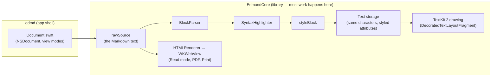

# Edmund architecture: developer overview

The human-readable tour of Edmund's internals, written for developers new to
the codebase. Every claim here points at the doc or section that owns it. If
you're an agent making a change fast, read
[`../ARCHITECTURE.md`](../ARCHITECTURE.md) instead.

## 1. Why

Edmund is a native macOS Markdown editor with live preview: what you type is
styled in place, in the same text view, with no split pane. AppKit +
TextKit 2, built with SwiftPM, macOS 14+.

Two design decisions explain almost everything else in the codebase. They
are the project's invariants (owned by [`../ARCHITECTURE.md`](../ARCHITECTURE.md) §2):

1. **The text storage always equals the raw Markdown source.** Styling only
   ever changes *attributes* (fonts, colors, spacing) — never the characters.
   Delimiters like `**` are hidden with a near-invisible font, not deleted.
   *Why:* if the text on screen is byte-for-byte the file on disk, then
   saving, undo, selection, and cursor math are all trivially correct — there
   is no mapping layer between "what you see" and "what you have" to get
   wrong.
2. **TextKit 2 only.** TextKit 2 lays out only what's on screen, which is
   what keeps huge documents fast. Certain API calls silently switch AppKit
   back to TextKit 1 (whole-document layout), so they are banned.
   *Why:* performance on large files is a core feature, and the fallback is
   silent — you'd never know you lost it.

## 2. High-level overview



One parser, two back-ends: the editor styles attributes in place; Read mode
and export render the same parsed document to HTML. They share the theme, so
they can't drift apart.

The most important files:

| File | What it is |
| --- | --- |
| `Sources/EdmundCore/TextView/EditorTextView.swift` | The editor view itself; state lives here (plus many `EditorTextView+*.swift` extensions) |
| `Sources/EdmundCore/Parsing/BlockParser.swift` | Splits the source into blocks (paragraph, heading, list, code fence, …) |
| `Sources/EdmundCore/Parsing/SyntaxHighlighter.swift` | Finds the styling spans inside a block (bold, links, callouts, math, …) |
| `Sources/EdmundCore/Rendering/EditorTextView+Rendering.swift` | `styleBlock` — turns one block's spans into attributes |
| `Sources/EdmundCore/TextView/EditorTextView+Composition.swift` | The recompose paths — the only place styled attributes are written to storage |
| `Sources/EdmundCore/TextView/EditorTextView+TextKit2.swift` | Custom drawing: callout boxes, quote bars, icons, math overlays |
| `Sources/EdmundCore/Export/HTMLRenderer.swift` | Read mode / PDF / Print HTML back-end |
| `Sources/edmd/App/Document.swift` | App shell: document lifecycle, Edit ↔ Read switching |

Full file-to-feature map: [`../ARCHITECTURE.md`](../ARCHITECTURE.md) §6.

## 3. Specs

Most detailed specs live where they belong: as comments at the code, and in
the dense agent doc. Start here instead for the two subsystems with deep
write-ups:

- [`editor-pipeline.md`](editor-pipeline.md) — source → parse → style →
  storage, the recompose paths, lazy styling, incremental parsing.
- [`text-system.md`](text-system.md) — why TextKit 2 only, how custom
  drawing works, hiding, the height-estimate and image-wedge constraints.
- [`reader-and-export.md`](reader-and-export.md) — Read mode's WKWebView,
  the sandbox and raw-HTML policy, PDF/Print, mode-switch viewport sync.
- [`macos-integrations.md`](macos-integrations.md) — Services, App Intents,
  Quick Look preview, AppleScript syntax; and the two signing/toolchain
  limitations (App Intents metadata, ad-hoc appex launch).
- [`editor-affordances.md`](editor-affordances.md) — the editor-only display
  features: invisibles, list indent guides, line numbers, focus mode, and the
  re-vend rule (`refreshOverdraw()`) they all depend on.
- [`hard-wrap.md`](hard-wrap.md) — hard wrap as a property of the *file*:
  unwrap on open, re-wrap on save, and how the column is derived from the
  file's own existing breaks.
- Planned, not yet written: `edit-flow-and-undo.md`,
  `app-shell-and-settings.md`.

Sibling folders:

- [`../investigations/`](../investigations/) — chronicles of hard bugs, one
  doc per bug class, round by round. `archives/` holds closed classes.
- [`../dev-guides/`](../dev-guides/) — method docs (how to do something).
  Start with [`live-repro-guide.md`](../dev-guides/live-repro-guide.md) when
  reproducing a live-app bug.

### Quirks you'll hit early

- **A "successful" build can be stale.** `swift build` sometimes prints
  `Build complete!` without relinking, so you run old code.
  [`../ARCHITECTURE.md`](../ARCHITECTURE.md) §8 has the detection and cure.
- **Delimiters are hidden, not stripped.** `**bold**` keeps its asterisks in
  storage; they're rendered near-invisible (invariant 1).
- **TextKit 2 height estimates cause most viewport glitches.** A paragraph
  has a real height only once laid out; before that it's an estimate.
  Mitigations: [`../ARCHITECTURE.md`](../ARCHITECTURE.md) §8; history:
  [`../investigations/viewport-glitch-investigation.md`](../investigations/viewport-glitch-investigation.md).
- **Images can't be drawn on wrapping (multi-line) lines** — drawing one
  collapses the layout to one line. [`../ARCHITECTURE.md`](../ARCHITECTURE.md)
  §9; the saga:
  [`../investigations/archives/callout-title-wrap-investigation.md`](../investigations/archives/callout-title-wrap-investigation.md).
- **Never change the text storage while an IME is composing** (typing
  Chinese/Japanese/accents) — it can permanently break the storage==source
  sync. [`../ARCHITECTURE.md`](../ARCHITECTURE.md) §8; the investigation:
  [`../investigations/delete-drift-investigation.md`](../investigations/delete-drift-investigation.md).

### Getting started

```bash
swift build   # debug build of both targets
swift test    # full suite
```

Tests live in `Tests/EdmundTests`. Before committing, run the pre-commit
checklist in [`../ARCHITECTURE.md`](../ARCHITECTURE.md) §12.
