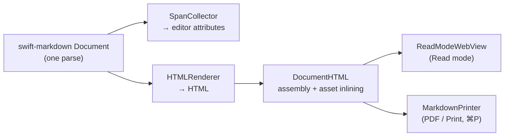

# Read mode & export: the HTML back-end

Expands [`../ARCHITECTURE.md`](../ARCHITECTURE.md) §6 (Read mode, view
modes, mode-switch sync) and §10 (raw HTML policy). The invariants are
owned by §2 there.

## 1. Why

Read mode is **not** an editor styling mode. It's a separate `WKWebView`
that renders the document as themed HTML. Entering `.reading` swaps the
editor's scroll view out for the webview; Edit and Source stay on the
`EditorTextView`.

Why a second renderer instead of restyling the editor: HTML gives real
typographic layout for reading (and is exactly what PDF export and printing
need), while the editor must keep raw characters in storage. Why they can't
drift apart: both back-ends walk the *same* `swift-markdown` `Document` the
editor parses — one parser, two back-ends (`SpanCollector` → editor
attributes, `HTMLRenderer` → HTML) — and both are themed from the same
`EditorTheme`/`CalloutStyle` via `HTMLTheme`.

## 2. High-level overview



| File (in `Sources/EdmundCore/Export/`) | Job |
| --- | --- |
| `HTMLRenderer.swift` | `MarkupVisitor` → HTML; raw-HTML filtering; line anchors |
| `HTMLTheme.swift` | `EditorTheme` → CSS |
| `DocumentHTML.swift` | Page assembly, CSP meta, asset inlining (math + local images → data URIs, Mermaid → inline SVG), the image-policy chokepoint |
| `ReadModeWebView.swift` | The sandboxed webview + scroll-position mapping |
| `MarkdownPrinter.swift` | Same HTML through `WKWebView.printOperation` — real vector (selectable) text |

`Document.refreshReadView()` keeps an open Read view in sync with edits and
theme changes. Code blocks are syntax-colored by the same `CodeHighlighter`
+ `CodeSyntaxPalette` as Edit mode. Callout/checkbox icons are inline
Lucide SVG (vector); math glyphs are high-DPI PNG (SwiftMath has no SVG
output yet) — in PDF export, everything else is vector.

Math classing (classing agrees with Edit mode via the shared
`parseDisplayMath`): a `$$…$$` that is a whole paragraph is a block
(`math-display`); one embedded in a prose line is `math-display-inline`, which
`DocumentHTML.fillMath` fills as a `display:block` span
(`.math-display-block`) so it gets its own centered line with the prose
flowing above and below — a `<span>`, not a `<div>`, because the placeholder
sits inside the paragraph's `<p>`. **This is a deliberate divergence**: Edit
mode still flows that case inline, because breaking the line around the run
needs a line break where the source has no break character, which
storage==rawSource forbids. A `$$` inside code stays literal.

### Mermaid diagrams (the "Mermaid" extension)

A ` ```mermaid ` fence renders as an **inline SVG**, in Read mode, HTML export
and PDF (vector — strictly better than math's PNGs). Off unless the Mermaid
extension is enabled and its payload installed; see ARCHITECTURE §Extensions.

Two passes, because `HTMLRenderer` is pure and non-isolated and so cannot reach
the `@MainActor` renderer:

1. `HTMLRenderer.visitCodeBlock` **wraps** its ordinary code block in
   `<div class="mermaid-diagram" data-source="<base64>">…</div>`. Base64 so no
   markdown punctuation can break out of the attribute.
2. `DocumentHTML.fillMermaid` (before `fillMath`, so a diagram is never scanned
   for `$…$`) replaces the placeholder with the SVG — or unwraps it.

**Wrapping rather than replacing is the point.** Every fallback — extension
disabled, payload absent, diagram doesn't parse — unwraps to exactly the markup
a normal fence produces, copy button and syntax colouring included, so the
fallback cannot drift from the real thing. The pass must run **even when the
extension is off**, or raw `data-source="…"` placeholders leak into the
finished document. Unwrapping moves the block's `edmund-l<N>` anchor onto the
code block, or a fenced diagram becomes a hole in Read mode's scroll-sync
anchors.

The SVG is spliced in as live markup, not an opaque image, so
`MermaidRenderer.isSafeSVG` is a trust boundary: it rejects script,
`foreignObject`, `use`, event-handler attributes, `@import`, and any `url()`
that is not a same-document fragment reference. **`url(#…)` must stay
allowed** — that is how every arrowhead is drawn (nine in a five-node
flowchart); rejecting `url(` outright silently strips them all.

Colours: only `--bg`/`--fg` are passed, and the library derives the rest by
mixing them at fixed percentages. The CSS rule resets `--line`/`--accent`/
`--muted`/`--surface`/`--border` to `initial` on the SVG, because the page
defines `--accent` (the link colour) on `:root` and it inherits in — arrowheads
were being painted link-blue. No font is passed either: the library's box sizes
come from an Inter-calibrated character-width heuristic, so the editor's serif
body face would risk labels overflowing their boxes.

**This is a deliberate divergence**: Edit mode still shows the raw fence as a
code block. Rendering there needs a raster `NSImage`, and CoreSVG (what
`NSImage(data:)` uses) is tuned for SF Symbols and would likely drop the `<text>`
and `<marker>` elements — a diagram with no labels or arrowheads. The
alternative, an async offscreen `WKWebView` snapshot, reintroduces the
fragment-height-estimate churn documented in ARCHITECTURE §6.1.

## 3. Specs

### Sandbox & link policy

The webview needs no file or network reach:

- JavaScript disabled (`allowsContentJavaScript = false`); the page carries
  a `script-src 'none'` CSP meta (`DocumentHTML.full` — Read and Print/PDF
  both consume it); loaded against `baseURL: nil` / explicit `about:blank`.
- Every asset is inlined: math and icons as data URIs; local images as data
  URIs via a `baseURL` (the document's directory) threaded through
  `DocumentHTML`/`ReadModeWebView`/`MarkdownPrinter`. Remote images are off
  by default (`ReadRenderOptions.allowRemoteImages`).
- External `http`/`https`/`mailto` links open in the default browser;
  `file:` and unknown schemes are cancelled instead of fetched in-view.
- `[[Wikilinks]]` and relative markdown links are emitted with private URL
  schemes (`x-edmund-wiki:`, `x-edmund-link:`) so the nav coordinator can
  intercept them and route through the app's document graph — no JavaScript
  involved.

### Raw HTML policy

Read renders raw HTML per GFM (§6.10 inline / §4.6 blocks); Edit shows it
as colored source — the GitHub split (rendered HTML in Edit is impossible
under the storage==rawSource invariant).

The filter, `HTMLRenderer.filterRawHTML`, is the GFM tagfilter (§6.11: the
nine dangerous tag names get `<` → `&lt;`) **plus** hardening beyond spec:
`on*` event-handler attributes stripped, `javascript:`/`vbscript:` URL
schemes neutralized. The sandbox above (JS off, CSP, `baseURL: nil`) sits
behind the filter as defense in depth.

A raw `` (lone or inside a block) is rewritten to the `md-image`
placeholder — the only way images load under `baseURL: nil`, and the
remote-image-policy chokepoint (`DocumentHTML.fillImages`).

Edit-mode side: `.htmlBlock` blocks (all seven §4.6 start conditions in
`BlockParser`) and inline tags (full §6.10 grammar in `parseHTMLTags`)
render as colored source. The `SyntaxHighlighter.htmlFormatTags` whitelist
(`u`/`kbd`/`mark`/`sub`/`sup`/`small`) is *presentation* in Edit (rendered
formatting), not sanitization.

Deliberate divergences from spec:

- The HTML comment regex is laxer (interior `--` allowed).
- A `<`-line that forms a valid table header+separator becomes a table
  (tables win).
- The type-1 tag set is pinned to CommonMark 0.29 (`script|pre|style`, no
  `textarea`).
- A lone self-closing `<script/>` is a type-7 HTML block, not a paragraph.
- The Edit-mode `htmlPairRegex` attr swallow breaks on `>` inside a quoted
  attribute of a whitelist open tag (falls back to colored source).

### Mode-switch viewport sync (Edit ↔ Read)

Line-accurate in both directions:

- Every top-level block in the read HTML carries `id="edmund-l<startLine>"`
  (spliced in `HTMLRenderer.visitDocument`;
  `ReadModeAnchors.topLevelBlockSpans` exposes the same 1-indexed line
  spans to callers).
- `ReadModeWebView` reads and sets its scroll position as (anchor line,
  fraction-into-block) via `evaluateJavaScript` — which runs even with
  content JS disabled and the CSP: both gate only *page content* JS;
  API-injected JS is a separate trusted channel, so the sandbox is
  unchanged. The JS is static templates interpolating only Swift-computed
  numbers.
- `Document` maps the editor side with `topmostVisibleCharacterOffset()` /
  `line(forOffset:)` / `offset(forLine:)` / `scrollCharacterToTop(_:)`.
  Entry and exit use the same `lineCount` denominator, so an untouched
  round trip is a fixed point.
- Both swap directions are deferred so no intermediate frame is visible:
  Edit→Read swaps in `onLoadFinished` (an HTML cache makes unchanged
  re-entries instant and skips the reload); Read→Edit swaps in
  `readScrollPosition`'s completion, after the editor is positioned while
  still hidden. Re-renders (appearance flip, settings) self-capture and
  restore their scroll.

Two gotchas this feature learned the hard way (owned by
[`../ARCHITECTURE.md`](../ARCHITECTURE.md) §8): capture any viewport anchor
*before* the `viewMode` setter runs, and a far scroll must
style-then-lay-out everything above its target before measuring.
