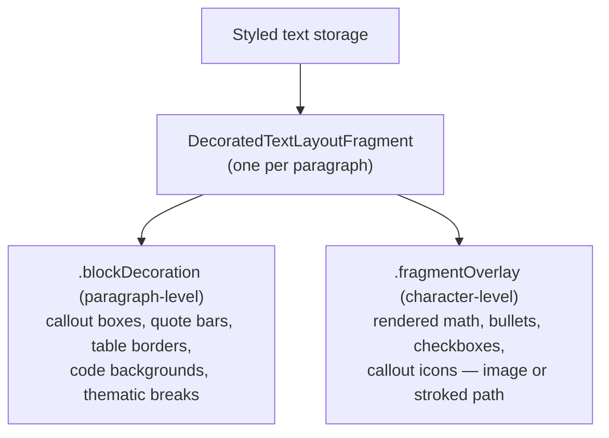

# Text system: TextKit 2 drawing model

Expands [`../ARCHITECTURE.md`](../ARCHITECTURE.md) §2 (invariants) and §5
(TextKit 2 specifics). Seeded also from the two archived callout
investigations (`../investigations/archives/`) and
[`../investigations/viewport-glitch-investigation.md`](../investigations/viewport-glitch-investigation.md).

## 1. Why

**Why TextKit 2 only.** TextKit 2 (`NSTextLayoutManager`) lays out only
what's on screen; TextKit 1 lays out the whole document up front. Viewport
layout is what makes large documents fast — and it's the whole reason big
files feel instant in Edmund.

The price: certain calls silently and *permanently* switch AppKit back to
TextKit 1, with no error. The banned calls: touching
`NSTextView.layoutManager`, or storing `NSTextBlock`/`NSTextTable`
attributes. Even a well-meaning "just check the line count" helper or a
debugger inspection can trigger the fallback.

**Why custom drawing.** Because storage must equal `rawSource`
(invariant 1), Edmund can't insert picture characters or use
`NSTextAttachment` (TextKit 2 only honors attachments on the placeholder
character U+FFFC, which real Markdown never contains). So every visual that
isn't plain styled text — callout boxes, icons, rendered math, checkboxes —
is *drawn* by a custom layout fragment, anchored to characters that are
really there.

## 2. High-level overview

`DecoratedTextLayoutFragment`
(`Sources/EdmundCore/TextView/DecoratedTextLayoutFragment.swift`) is a custom
`NSTextLayoutFragment` — the object TextKit 2 uses to lay out and draw one
paragraph. It reads two custom attributes out of the styled text and paints
them behind/over the laid-out characters:

The DEBUG guard: `EditorTextView`
(`Sources/EdmundCore/TextView/EditorTextView.swift`) observes
`NSTextView.willSwitchToNSLayoutManagerNotification` and calls
`assertionFailure` if it fires — a debug build crashes loudly at the moment
of a TextKit 1 regression instead of silently degrading. Release builds
have no guard; the regression there is just slow.

## 3. Specs

### `.blockDecoration` (paragraph-level)

Fragment frames tile vertically, so a multi-line quote/callout run renders
as one continuous box or bar across its fragments. Two non-obvious rules:

- A `.box` decoration's `bottomPad` grows the *last* fragment's own
  `layoutFragmentFrame`, not just its drawing. TextKit 2 excludes trailing
  `paragraphSpacing` from a fragment's height, so padding added only at
  draw time would be dead space — clicks there would miss the text.
  Growing the frame keeps the extra height clickable and tiling correctly.
- When a callout is the document's last block and the source ends with a
  trailing newline, TextKit 2 folds that empty final line into the
  *preceding* fragment. Painting the decoration over the full frame height
  would flood callout color onto the empty line; `decorationDrawHeight`
  detects the absorbed line and stops the fill at the last real content
  line plus `bottomPad`.

### `.fragmentOverlay` (character-level)

An image *or* a stroked vector path drawn at one character's laid-out
position. Examples: rendered math, list bullets/checkboxes, the callout
header icon+name image, the custom-title callout icon.

The mechanism: the anchor character is hidden (below), and `.kern` on it
reserves the overlay's drawing width as advance space, so following text
starts clear of where the overlay will be painted — the same trick the
table renderer uses for column alignment. `draw(at:in:)` then paints the
image or strokes the path at the anchor's computed position.

### Hiding mechanics

`hiddenFont` is `NSFont.systemFont(ofSize: 0.01)`, paired with a clear
`foregroundColor`. The character is still there — selection can span it,
undo round-trips it — it simply occupies no visible space and paints
nothing. This is how delimiters (and overlay anchors) vanish without
changing the string.

### Height estimates: the root of most viewport glitches

TextKit 2 gives a fragment a *real* frame only once it has actually been
laid out; everything else (including the running total used for document
height and scroll math) is an *estimate*, corrected as layout catches up.
The correction is what makes the scroller jump, drag-selection autoscroll
oscillate, and scroll-to-target land wrong — a widely documented TextKit 2
limitation (even TextEdit shows it).

Edmund's mitigations, converging in
`Sources/EdmundCore/TextView/EditorTextView+LazyStyling.swift`:

- Documents ≤ `fullLayoutMaxLength` (100k UTF-16 units) are kept **fully
  laid out** once styling converges, via a coalesced next-run-loop settle
  (`scheduleFullLayoutSettle`) wrapped in `preservingViewportAnchor` so the
  correction can't visibly shift what's on screen. Larger documents stay
  viewport-based; a full layout there is the process-killing path.
- `repairContentAboveOrigin` detects a first fragment drifted *above* y=0
  (edits near the top can leave the scroller stuck with unreachable content
  above it) and re-lays start→viewport, again inside
  `preservingViewportAnchor`.
- Undo/redo avoids resetting layout at all where possible (see
  [`editor-pipeline.md`](editor-pipeline.md), recompose paths).

Full bug chronicle:
[`../investigations/viewport-glitch-investigation.md`](../investigations/viewport-glitch-investigation.md).

### The image-wedge constraint

Drawing an *image* `.fragmentOverlay` on a **wrapping, multi-line**
fragment re-triggers a layout pass that collapses ("wedges") the fragment
to a single line, clipping whatever wrapped. Drawing a *shape* (a stroked
`CGPath`) does not.

Default callout headers get away with an image overlay: their synthesized
icon+name text is short and never wraps. The **custom-title** callout
header can wrap (user-supplied title), so its icon is a stroked `CGPath` —
parsed from the vendored Lucide SVG geometry by `SVGPath`
(`Sources/EdmundCore/Model/SVGPath.swift`), scaled and drawn directly in
`CGContext`, never rasterized to an `NSImage`. Any *new* overlay that could
share a line with wrapping text inherits this constraint. Full
investigation, including rejected mechanisms:
[`../investigations/archives/callout-title-wrap-investigation.md`](../investigations/archives/callout-title-wrap-investigation.md).
